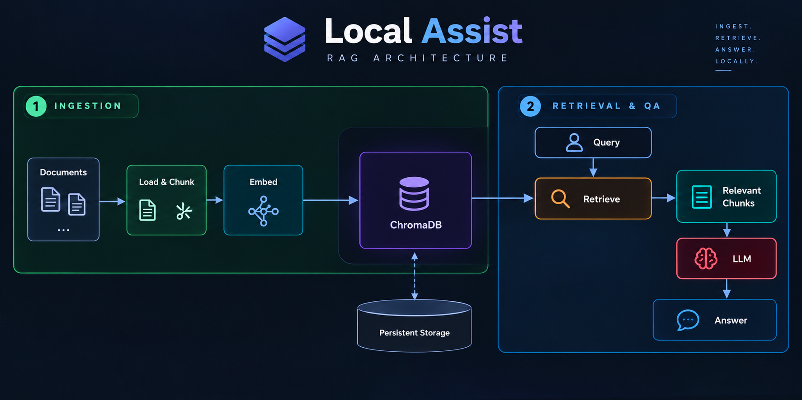

# Local Assist

> **Version 1 — Dense Retrieval Baseline**

Local Assist is a local Retrieval-Augmented Generation (RAG) project designed to turn a codebase and its documentation into a searchable knowledge base.

The main goal of **V1** is not to build a highly optimized RAG system immediately, but to establish a clean, measurable **dense-retrieval baseline** that can be improved and compared against future retrieval strategies.

The project currently focuses on:

- Loading local documents and source code
- Parsing PDFs and programming-language files
- Splitting content into retrieval-friendly chunks
- Creating stable IDs for chunks
- Generating dense embeddings
- Persisting embeddings and metadata in ChromaDB
- Retrieving the most relevant chunks for a query
- Evaluating retrieval quality using **Recall@k**

### Why Local Assist?

Keeping the retrieval pipeline local provides a foundation for working with private codebases and documents without requiring a hosted vector database or external retrieval API.

More importantly, the project is being developed as an **experimental RAG system**: each version is measured, documented, and improved based on retrieval failures rather than only subjective answer quality.

---

## Project Structure — V1

```text
local_assist/
│
├── app/
│   ├── ingest.py              # Ingestion pipeline entry point
│   └── retrieve.py            # Dense retrieval
│
├── data_ingestion/
│   ├── __init__.py
│   ├── process_dir.py         # Loading, parsing, chunking, chunk IDs
│   ├── embeddings.py          # Embedding model
│   └── store.py               # ChromaDB vector store
│
├── evaluation/
│   ├── chunks.jsonl           # Chunk-level evaluation data
│   ├── dataset.json           # Evaluation dataset
│   ├── dataset.py             # Dataset generation/utilities
│   └── rag_eval_dataset.json  # RAG evaluation questions
│
├── requirements.txt
└── README.md
```

---

## Architecture



The architecture is split into two main stages:

**Ingestion**

`Documents → Load & Chunk → Embed → ChromaDB`

**Retrieval**

`Query → Retrieve → Relevant Chunks`

V1's reported experiments evaluate the **retrieval layer** using dense embeddings. The generation/LLM stage shown in the architecture represents the broader RAG workflow and is not part of the Recall@k results reported below.

---

## Tech Stack

| Component | Technology | Purpose |
|---|---|---|
| Language | Python | Core implementation |
| RAG framework | LangChain | Document loading and processing utilities |
| PDF parser | PyMuPDF / `PyMuPDFLoader` | Extract text from PDF files |
| Code parser | `LanguageParser` + `GenericLoader` | Parse source-code files |
| Chunker | `RecursiveCharacterTextSplitter` | Split documents into overlapping chunks |
| Embeddings | `Qwen/Qwen3-Embedding-0.6B` | Convert chunks and queries into dense vectors |
| Embedding runtime | Sentence Transformers | Load and run the embedding model |
| Vector database | ChromaDB | Store embeddings, documents, and metadata |
| Evaluation | Custom Python evaluation pipeline | Measure retrieval Recall@k |

### Document Processing

The ingestion pipeline supports PDFs and source-code files.

- **PDFs:** loaded using LangChain's `PyMuPDFLoader`.
- **Source code:** loaded through `GenericLoader` with `LanguageParser`.
- **Chunking:** performed using `RecursiveCharacterTextSplitter`.
- **Chunk IDs:** generated deterministically using a SHA-256 hash of the source and chunk content. This makes evaluation reproducible across runs.

### Embeddings

V1 uses:

```text
Qwen/Qwen3-Embedding-0.6B
```

The same embedding model is used for both document chunks and user queries, allowing retrieval through vector similarity.

### Vector Store

ChromaDB is used as the persistent vector store.

Each stored record contains:

- Chunk ID
- Chunk text
- Embedding
- Document metadata

The current V1 retrieval implementation performs dense similarity search and returns the requested number of results.

---

## V1 Evaluation

The first objective was to establish a baseline for **dense retrieval quality**.

### Evaluation Setup

All three experiments used the same configuration except for `k`:

| Parameter | Value |
|---|---|
| Chunk size | 1000 |
| Chunk overlap | 200 |
| Embedding model | `Qwen/Qwen3-Embedding-0.6B` |
| Search type | Dense embeddings |
| Evaluation queries | 28 |
| Metric | Recall@k |
| Tested k | 5, 10, 20 |

Recall@k measures how much of the relevant ground-truth content was successfully retrieved within the top `k` results.

---

### Test 1 — k = 5

**Average Recall@5: `0.4107`**

With only five retrieved chunks, the baseline recovered roughly **41.1%** of the relevant content on average.

This establishes the initial dense-retrieval baseline.

---

### Test 2 — k = 10

**Average Recall@10: `0.5208`**

Increasing `k` from 5 to 10 improved average recall by about **11 percentage points**.

This shows that some relevant chunks were present in the larger candidate set but were ranked below the first five results.

---

### Test 3 — k = 20

**Average Recall@20: `0.5923`**

Increasing `k` to 20 produced the best result of the three experiments.

However, average recall still remained below 60%, and several queries continued to receive zero recall.

This is an important observation: **increasing k helps, but does not completely solve the retrieval problem.**

---

## V1 Results

| Configuration | Average Recall |
|---|---:|
| Dense, k = 5 | **0.4107** |
| Dense, k = 10 | **0.5208** |
| Dense, k = 20 | **0.5923** |

### Key Observation

Recall improves consistently as `k` increases:

```text
Recall@5   → 41.07%
Recall@10  → 52.08%
Recall@20  → 59.23%
```

But the presence of queries with **Recall = 0 even at k = 20** indicates that the problem is not simply "retrieve more documents."

The dense retriever is sometimes failing to place the relevant chunk inside the candidate set at all.

That makes **retrieval strategy** the next major area to investigate.

---

## Next Step

**V1 establishes the dense-retrieval baseline.**

The next iteration will investigate **hybrid retrieval**, combining:

```text
Dense Retrieval
      +
BM25 / Sparse Retrieval
      ↓
Rank Fusion
      ↓
Improved Candidate Set
```

The purpose of V2 will be to determine whether lexical retrieval can recover relevant chunks that dense semantic retrieval misses, and whether the combined system improves Recall@k over the V1 baseline.

---

## Status

**V1 — Baseline complete**

- [x] Document ingestion
- [x] PDF and source-code parsing
- [x] Chunking
- [x] Deterministic chunk IDs
- [x] Dense embeddings
- [x] ChromaDB storage
- [x] Dense retrieval
- [x] Evaluation dataset
- [x] Recall@5 evaluation
- [x] Recall@10 evaluation
- [x] Recall@20 evaluation
- [ ] Hybrid retrieval — V2
- [ ] Retrieval reranking
- [ ] Further evaluation and optimization
