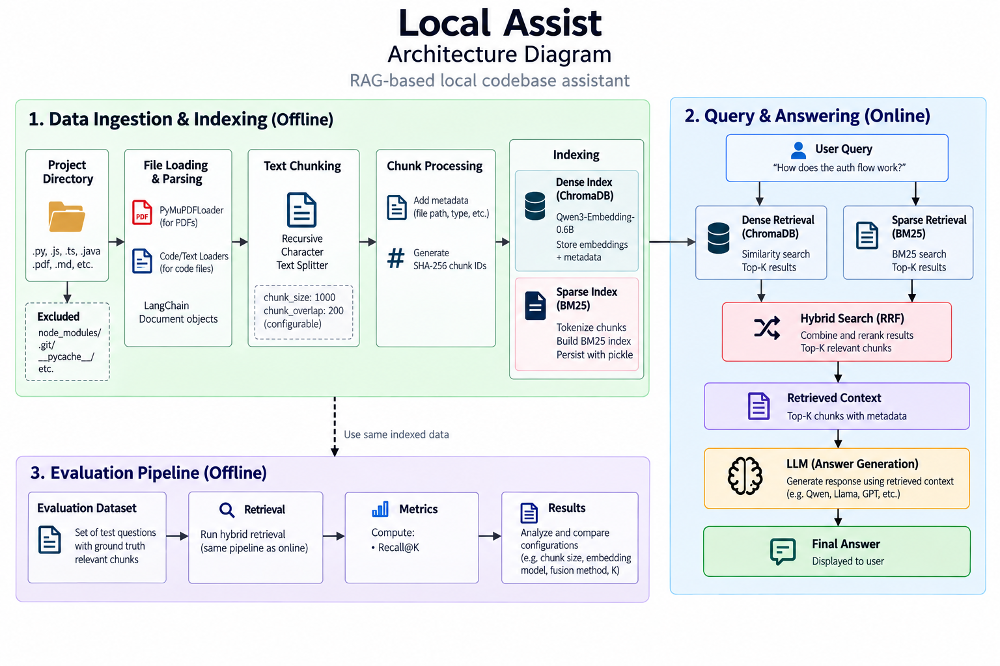

# Local Assist

> **Version 1 — Dense Retrieval Baseline**

Local Assist is a local Retrieval-Augmented Generation (RAG) project designed to turn a codebase and its documentation into a searchable knowledge base.

The main goal of **V1** is not to build a highly optimized RAG system immediately, but to establish a clean, measurable **dense-retrieval baseline** that can be improved and compared against future retrieval strategies.

The project currently focuses on:

- Loading local documents and source code
- Parsing PDFs and programming-language files
- Splitting content into retrieval-friendly chunks
- Creating stable IDs for chunks
- Generating dense embeddings
- Persisting embeddings and metadata in ChromaDB
- Retrieving the most relevant chunks for a query
- Evaluating retrieval quality using **Recall@k**

### Why Local Assist?

Keeping the retrieval pipeline local provides a foundation for working with private codebases and documents without requiring a hosted vector database or external retrieval API.

More importantly, the project is being developed as an **experimental RAG system**: each version is measured, documented, and improved based on retrieval failures rather than only subjective answer quality.

---

## Project Structure — V1

```text
local_assist/
│
├── app/
│   ├── ingest.py              # Ingestion pipeline entry point
│   └── retrieve.py            # Dense retrieval
│
├── data_ingestion/
│   ├── __init__.py
│   ├── process_dir.py         # Loading, parsing, chunking, chunk IDs
│   ├── embeddings.py          # Embedding model
│   └── store.py               # ChromaDB vector store
│
├── evaluation/
│   ├── chunks.jsonl           # Chunk-level evaluation data
│   ├── dataset.json           # Evaluation dataset
│   ├── dataset.py             # Dataset generation/utilities
│   └── rag_eval_dataset.json  # RAG evaluation questions
│
├── requirements.txt
└── README.md
```

---

## Architecture


The architecture is split into two main stages:

**Ingestion**

`Documents → Load & Chunk → Embed → ChromaDB`

**Retrieval**

`Query → Retrieve → Relevant Chunks`

V1's reported experiments evaluate the **retrieval layer** using dense embeddings. The generation/LLM stage shown in the architecture represents the broader RAG workflow and is not part of the Recall@k results reported below.

---

## Tech Stack

| Component | Technology | Purpose |
|---|---|---|
| Language | Python | Core implementation |
| RAG framework | LangChain | Document loading and processing utilities |
| PDF parser | PyMuPDF / `PyMuPDFLoader` | Extract text from PDF files |
| Code parser | `LanguageParser` + `GenericLoader` | Parse source-code files |
| Chunker | `RecursiveCharacterTextSplitter` | Split documents into overlapping chunks |
| Embeddings | `Qwen/Qwen3-Embedding-0.6B` | Convert chunks and queries into dense vectors |
| Embedding runtime | Sentence Transformers | Load and run the embedding model |
| Vector database | ChromaDB | Store embeddings, documents, and metadata |
| Evaluation | Custom Python evaluation pipeline | Measure retrieval Recall@k |

### Document Processing

The ingestion pipeline supports PDFs and source-code files.

- **PDFs:** loaded using LangChain's `PyMuPDFLoader`.
- **Source code:** loaded through `GenericLoader` with `LanguageParser`.
- **Chunking:** performed using `RecursiveCharacterTextSplitter`.
- **Chunk IDs:** generated deterministically using a SHA-256 hash of the source and chunk content. This makes evaluation reproducible across runs.

### Embeddings

V1 uses:

```text
Qwen/Qwen3-Embedding-0.6B
```

The same embedding model is used for both document chunks and user queries, allowing retrieval through vector similarity.

### Vector Store

ChromaDB is used as the persistent vector store.

Each stored record contains:

- Chunk ID
- Chunk text
- Embedding
- Document metadata

The current V1 retrieval implementation performs dense similarity search and returns the requested number of results.

---

## V1 Evaluation

The first objective was to establish a baseline for **dense retrieval quality**.

### Evaluation Setup

All three experiments used the same configuration except for `k`:

| Parameter | Value |
|---|---|
| Chunk size | 1000 |
| Chunk overlap | 200 |
| Embedding model | `Qwen/Qwen3-Embedding-0.6B` |
| Search type | Dense embeddings |
| Evaluation queries | 28 |
| Metric | Recall@k |
| Tested k | 5, 10, 20 |

Recall@k measures how much of the relevant ground-truth content was successfully retrieved within the top `k` results.

---

### Test 1 — k = 5

**Average Recall@5: `0.4107`**

With only five retrieved chunks, the baseline recovered roughly **41.1%** of the relevant content on average.

This establishes the initial dense-retrieval baseline.

---

### Test 2 — k = 10

**Average Recall@10: `0.5208`**

Increasing `k` from 5 to 10 improved average recall by about **11 percentage points**.

This shows that some relevant chunks were present in the larger candidate set but were ranked below the first five results.

---

### Test 3 — k = 20

**Average Recall@20: `0.5923`**

Increasing `k` to 20 produced the best result of the three experiments.

However, average recall still remained below 60%, and several queries continued to receive zero recall.

This is an important observation: **increasing k helps, but does not completely solve the retrieval problem.**

---

## V1 Results

| Configuration | Average Recall |
|---|---:|
| Dense, k = 5 | **0.4107** |
| Dense, k = 10 | **0.5208** |
| Dense, k = 20 | **0.5923** |

### Key Observation

Recall improves consistently as `k` increases:

```text
Recall@5   → 41.07%
Recall@10  → 52.08%
Recall@20  → 59.23%
```

But the presence of queries with **Recall = 0 even at k = 20** indicates that the problem is not simply "retrieve more documents."

The dense retriever is sometimes failing to place the relevant chunk inside the candidate set at all.

That makes **retrieval strategy** the next major area to investigate.

---

## Next Step

**V1 establishes the dense-retrieval baseline.**

The next iteration will investigate **hybrid retrieval**, combining:

```text
Dense Retrieval
      +
BM25 / Sparse Retrieval
      ↓
Rank Fusion
      ↓
Improved Candidate Set
```

The purpose of V2 will be to determine whether lexical retrieval can recover relevant chunks that dense semantic retrieval misses, and whether the combined system improves Recall@k over the V1 baseline.

---

## Status

**V1 — Baseline complete**

- [x] Document ingestion
- [x] PDF and source-code parsing
- [x] Chunking
- [x] Deterministic chunk IDs
- [x] Dense embeddings
- [x] ChromaDB storage
- [x] Dense retrieval
- [x] Evaluation dataset
- [x] Recall@5 evaluation
- [x] Recall@10 evaluation
- [x] Recall@20 evaluation
- [ ] Hybrid retrieval — V2
- [ ] Retrieval reranking
- [ ] Further evaluation and optimization

> **Version 2 — Hybrid Retrieval**

Local Assist is a local Retrieval-Augmented Generation (RAG) project designed to turn a codebase and its documentation into a searchable knowledge base.

**V1** established a dense-retrieval baseline using `Qwen/Qwen3-Embedding-0.6B` and ChromaDB. The baseline achieved an average **Recall@20 of 0.5923**.

V2 focuses on improving the retrieval layer by introducing **hybrid search**, combining semantic dense retrieval with lexical sparse retrieval using **BM25**.

The main objective of V2 is to determine whether combining semantic and lexical retrieval can recover relevant chunks that dense retrieval alone misses.

---

## What Changed in V2?

V2 introduces a second retrieval strategy alongside the dense retriever:

```text
                    User Query
                   /          \
                  /            \
        Dense Retrieval      BM25 Retrieval
              |                    |
              |                    |
        Semantic Results      Lexical Results
                  \            /
                   \          /
                    Rank Fusion
                        |
                        ↓
                Final Candidates
```

## Architecture Diagram



Instead of relying entirely on semantic similarity, the query is now sent through **two independent retrieval paths**:

* **Dense retrieval** — finds semantically similar content using embeddings.
* **Sparse retrieval** — finds lexically relevant content using BM25.
* **Rank fusion** — combines the results from both retrieval systems.

This allows the system to capture two different types of relevance.

### Dense Retrieval

Dense retrieval is useful when the query and relevant document use different words but express similar concepts.

For example:

```text
Query:
"How are vectors stored?"

Relevant chunk:
"Embeddings are persisted in ChromaDB..."
```

The wording is different, but the semantic meaning is related.

### BM25 Retrieval

BM25 is useful when exact terms, identifiers, function names, class names, or technical vocabulary are important.

For example:

```text
Query:
"SparseVectorStore"

Relevant chunk:
"class SparseVectorStore:"
```

A lexical retriever can strongly benefit from this exact token overlap.

Hybrid retrieval combines both strengths.

---

# The Problem Encountered During V2

The initial BM25 implementation did not immediately produce the expected improvement.

The sparse retriever was able to calculate BM25 scores, but there was an important problem:

**BM25 scores needed to be mapped back to the correct chunks.**

BM25 operates on a collection of tokenized documents and returns scores according to the position of each document in that collection.

Conceptually:

```text
BM25 Documents

Index 0 → Chunk A
Index 1 → Chunk B
Index 2 → Chunk C
Index 3 → Chunk D
...
```

The BM25 result therefore identifies documents through their position in the indexed corpus.

However, Local Assist evaluates retrieval using **stable chunk IDs**.

Without explicitly preserving the relationship between:

```text
BM25 index
      ↓
Chunk
      ↓
Chunk ID
```

the retrieval pipeline could not reliably determine which chunk a BM25 score belonged to.

This became particularly important when trying to combine BM25 results with dense retrieval results.

---

# Diagnosing the Bug

The issue became apparent while investigating unexpectedly poor hybrid-retrieval metrics.

The dense retriever was already producing reasonable results, with:

```text
Dense Recall@20 = 0.5923
```

Yet simply adding BM25 did not produce the expected improvement.

Instead of assuming that the retrieval strategy itself was ineffective, the retrieval pipeline was inspected step by step.

The BM25 process was effectively:

```text
Chunks
  ↓
Tokenization
  ↓
BM25 index
  ↓
Query
  ↓
BM25 scores
```

The missing piece was the explicit mapping:

```text
BM25 document position
          ↓
       Chunk ID
          ↓
      Chunk content
```

Without this mapping, BM25 scores could not be safely associated with the corresponding chunks for downstream rank fusion and evaluation.

---

# Fix

The solution was to persist the **chunk IDs in the same order as the documents used to construct the BM25 index**.

The resulting relationship becomes:

```text
BM25 Index
    |
    ├── 0 → chunk_id_001
    ├── 1 → chunk_id_002
    ├── 2 → chunk_id_003
    └── ...
```

When BM25 returns scores:

```text
BM25 scores
    ↓
Document positions
    ↓
Chunk IDs
    ↓
Actual chunks
```

This makes the sparse retrieval results deterministic and allows them to be correctly combined with the dense retrieval results.

The important principle is that the BM25 index and the chunk-ID list must preserve the **same ordering**.

---

# Hybrid Retrieval Pipeline

After fixing the BM25-to-chunk mapping, V2 uses the following retrieval flow:

```text
                         User Query
                        /          \
                       /            \
                      ↓              ↓
              Dense Retrieval      BM25
                      ↓              ↓
              Dense Results     Sparse Results
                      \              /
                       \            /
                        ↓          ↓
                       Rank Fusion
                           |
                           ↓
                    Final Candidate Set
                           |
                           ↓
                    Relevant Chunks
```

The two retrieval systems are intentionally kept separate until the fusion stage.

This provides a cleaner experimental setup because the contribution of each retrieval strategy can be measured independently.

---

# Rank Fusion

The purpose of rank fusion is to combine the rankings produced by the dense and sparse retrievers.

Dense retrieval produces one ranking:

```text
Dense:

Chunk A
Chunk C
Chunk F
Chunk B
...
```

BM25 produces another:

```text
BM25:

Chunk F
Chunk D
Chunk A
Chunk H
...
```

The same chunk can therefore appear in both retrieval systems.

Rank fusion combines these rankings into a single candidate ranking:

```text
Dense Ranking
       +
BM25 Ranking
       ↓
Rank Fusion
       ↓
Combined Ranking
```

This allows a chunk that is strongly supported by either retrieval strategy to remain in the final candidate set.

---

# V2 Configuration

The V2 experiments use the following configuration:

| Parameter          | Value                       |
| ------------------ | --------------------------- |
| Chunk size         | 1000                        |
| Chunk overlap      | 200                         |
| Embedding model    | `Qwen/Qwen3-Embedding-0.6B` |
| Dense search       | ChromaDB                    |
| Sparse search      | BM25                        |
| Retrieval strategy | Hybrid                      |
| Evaluation queries | 28                          |
| Metric             | Recall@k                    |
| Tested k           | 5, 10, 20, 50               |

The evaluation dataset remains the same as V1 so that the results can be compared directly.

Keeping the evaluation dataset consistent is important because changing both the retrieval system and evaluation data would make it difficult to determine whether improvements actually came from the retrieval strategy.

---

# V2 Evaluation

The primary metric remains **Recall@k**.

Recall@k measures how much of the relevant ground-truth content is present within the top `k` retrieved chunks.

For V2, the evaluation was extended to:

```text
Recall@5
Recall@10
Recall@20
Recall@50
```

The addition of `Recall@50` is particularly useful for examining whether hybrid retrieval can successfully recover relevant chunks that appear deeper in the ranking.

---

## V2 Results

The hybrid retriever currently achieves:

### Recall@50

**Average Recall@50: `0.72`**

This is currently the strongest retrieval result obtained by Local Assist.

```text
Hybrid Recall@50 → 72%
```

Compared with the V1 dense baseline:

```text
Dense Recall@20  → 59.23%
Hybrid Recall@50 → 72.00%
```

This represents an improvement of approximately **12.77 percentage points** over the V1 Recall@20 baseline.

However, the comparison should be interpreted carefully because the value of `k` is different. A more direct comparison should use the same `k` across both systems.

The important result is that the hybrid retriever is able to recover substantially more relevant content when the candidate set is expanded to 50 results.

---

# V1 vs V2

The progression of the retrieval system is:

| Version | Retrieval |  k | Average Recall |
| ------- | --------- | -: | -------------: |
| V1      | Dense     |  5 |     **0.4107** |
| V1      | Dense     | 10 |     **0.5208** |
| V1      | Dense     | 20 |     **0.5923** |
| V2      | Hybrid    | 50 |     **0.7200** |

Visualized:

```text
V1 Dense

Recall@5
   41.07%

Recall@10
   52.08%

Recall@20
   59.23%


V2 Hybrid

Recall@50
   72.00%
```

The V2 result indicates that adding a lexical retrieval signal can improve the candidate set available to the RAG pipeline.

---

# What V2 Demonstrates

V1 showed that increasing `k` improves recall:

```text
Recall@5  → 41.07%
Recall@10 → 52.08%
Recall@20 → 59.23%
```

However, the existence of queries with poor or zero recall suggested that simply retrieving more dense results was not always sufficient.

V2 approaches the problem differently.

Instead of asking:

> "How many more dense results should be retrieved?"

the system asks:

> "Can another retrieval strategy find information that dense retrieval misses?"

BM25 provides that second retrieval signal.

This is particularly relevant for code retrieval because source code contains many exact identifiers and technical terms where lexical matching can be valuable.

The current **Recall@50 of 0.72** suggests that hybrid retrieval is a promising improvement over the original dense-only approach.

---

# Engineering Lessons From V2

V2 was not simply an implementation of another retrieval algorithm. A significant part of the work involved debugging the interaction between the retrieval components.

The main lessons were:

### 1. Retrieval systems need stable document identity

Scores are not useful by themselves.

A retrieval score must ultimately be associated with the correct document or chunk:

```text
Score
  ↓
Document position
  ↓
Chunk ID
  ↓
Chunk
```

Stable chunk IDs make this relationship explicit.

### 2. Hybrid retrieval introduces data-consistency problems

Dense and sparse retrieval systems represent documents differently.

Dense retrieval operates through:

```text
Chunk → Embedding → Vector similarity
```

while BM25 operates through:

```text
Chunk → Tokens → Term statistics → BM25 score
```

Combining them requires a reliable common identifier.

### 3. Evaluation is useful for debugging, not only benchmarking

The unexpectedly poor initial hybrid results were a signal that something in the retrieval pipeline needed to be investigated.

Instead of treating the metric as just a final score, Recall@k was used as a debugging signal to inspect the retrieval pipeline.

---

# Current Architecture

The V2 architecture expands the retrieval stage of V1:

```text
                         Documents
                            |
                            ↓
                    Load & Parse
                            |
                            ↓
                         Chunk
                            |
                  ┌─────────┴─────────┐
                  ↓                   ↓
             Dense Store         Sparse Store
              ChromaDB              BM25
                  |                   |
                  └─────────┬─────────┘
                            |
                            ↓
                       User Query
                       /         \
                      /           \
                     ↓             ↓
              Dense Search     BM25 Search
                     |             |
                     └──────┬──────┘
                            ↓
                       Rank Fusion
                            |
                            ↓
                    Retrieved Chunks
                            |
                            ↓
                           LLM
                            |
                            ↓
                         Answer
```

The LLM is part of the overall RAG architecture, while the reported V2 metrics specifically evaluate the **retrieval layer**.

---

# Next Step

With hybrid retrieval producing a promising Recall@50 of **0.72**, the next stage is to move beyond retrieval-only experimentation and integrate the **LLM generation layer**.

The planned RAG pipeline is:

```text
User Query
     ↓
Hybrid Retrieval
     ↓
Relevant Chunks
     ↓
Context Construction
     ↓
LLM
     ↓
Generated Answer
```

The focus will then shift from:

```text
"Can I retrieve the relevant information?"
```

to:

```text
"Can I use the retrieved information to generate
a useful and grounded answer?"
```

This will allow Local Assist to be evaluated as a complete RAG system rather than only as a retrieval system.

---

# Status

**V2 — Hybrid retrieval complete**

* [x] Document ingestion
* [x] PDF and source-code parsing
* [x] Chunking
* [x] Deterministic chunk IDs
* [x] Dense embeddings
* [x] ChromaDB storage
* [x] Dense retrieval
* [x] Evaluation dataset
* [x] Recall@5 evaluation
* [x] Recall@10 evaluation
* [x] Recall@20 evaluation
* [x] BM25 sparse retrieval
* [x] Persistent BM25 index
* [x] Chunk ID mapping for BM25 results
* [x] Hybrid retrieval
* [x] Rank fusion
* [x] Recall@50 evaluation
* [x] V1 vs V2 retrieval comparison
* [ ] LLM integration
* [ ] End-to-end RAG evaluation
* [ ] Retrieval reranking
* [ ] Further optimization

---

## Version History

### V1 — Dense Retrieval Baseline

Established the initial retrieval pipeline using dense embeddings and ChromaDB.

**Best reported result:**

```text
Recall@20 = 0.5923
```

### V2 — Hybrid Retrieval

Added BM25 sparse retrieval, rank fusion, and fixed the chunk-ID mapping required to correctly associate BM25 results with their source chunks.

**Best reported result:**

```text
Recall@50 = 0.72
```

V2 demonstrates that combining **semantic retrieval + lexical retrieval** provides a stronger retrieval foundation for the next stage of Local Assist: **LLM-powered answer generation**.
